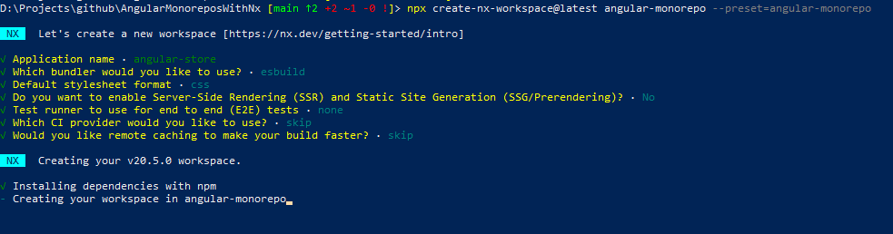

1) Tworzenie workspace i 1 aplikacji ANGULAR-STORE
```
npx create-nx-workspace@latest angular-monorepo --preset=angular-monorepo
```



```
cd angular-monorepo
npx nx serve angular-store


```

2) tworzenie 2 aplikacja INVENTORY
```
npx nx list @nx/angular
npx nx g @nx/angular:app apps/inventory --dry-run
npx nx g @nx/angular:application apps/inventory 
npx nx g @nx/angular:app apps/inventory
npx nx serve inventory --port=4201

```

współdzielone komponenty aplikacji
```
npx nx g @nx/angular:library libs/products --standalone
npx nx g @nx/angular:library libs/orders --standalone
npx nx g @nx/angular:library libs/shared/ui --standalone
```
